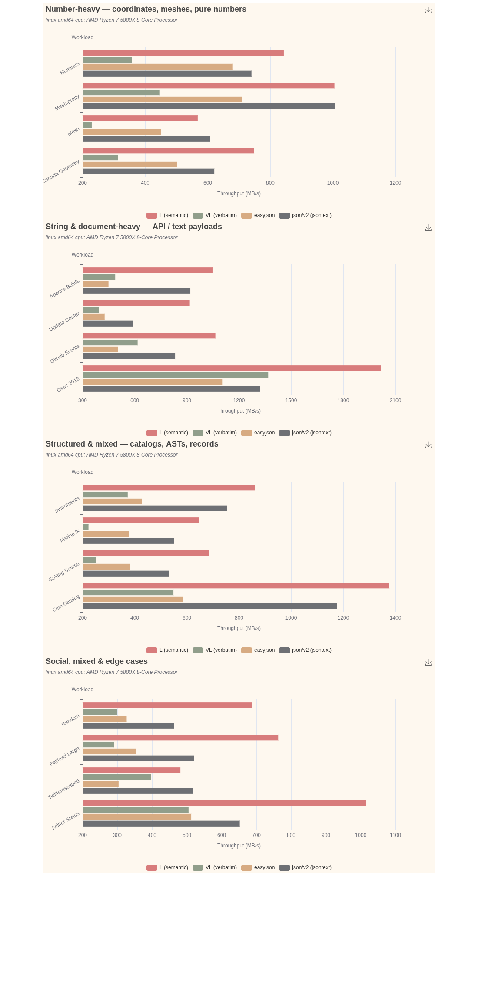

# Throughput chart (benchviz)

Input tokenization throughput (MB/s) for the in-repo `default-lexer` — both the
**semantic lexer `L`** and the **verbatim lexer `VL`** — against two external JSON
tokenizers: mailru/easyjson's `jlexer` (the lexer our design is inspired from) and
go-json-experiment's `jsontext` (`encoding/json/v2`), across **16 workloads**:
the 4-corpus parity set the lexer was tuned against, plus 12 "untrained" payloads
from the [simdjson-go](https://github.com/minio/simdjson-go) testdata (see
[`../workloads/testdata/SOURCE.md`](../workloads/testdata/SOURCE.md)).
Rendered with [benchviz](https://github.com/fredbi/benchviz).



## What you are looking at

The 16 workloads are split into **4 scenario charts** — number-heavy, string /
document-heavy, structured & mixed, and social / edge cases — so each auto-scales
to its own range. Within a chart, each cluster is one workload and the four bars
are the tokenizers side by side. Longer is faster. The numbers are the **median of
3 runs**. Each tokenizer drains the whole document to EOF; `b.SetBytes` is the input
size, so the bars are *input* throughput.

> Rendering the context-only y-axis labels (no redundant `lexers - ` prefix) needs
> a benchviz that drops the function prefix for single-function charts and honors
> the version `title` in the legend — see the config note below.

## Untrained ground

The lexer was tuned against only the parity 4-set (canada/citm/twitter/golang),
so the 12 simdjson payloads test whether the wins generalize. They do: **`L` beats
`jsontext` on 13 of 16 workloads** (9 of the 12 untrained), and two of its best
results are untrained string-heavy payloads — `update-center` (1.62×) and
`gsoc-2018` (1.52×, the long red bar). The three losses are all explained:
`twitterescaped` (0.93×) is dense `\uXXXX` escapes, our eager-unescape tradeoff;
`mesh`/`mesh.pretty` (0.93×/0.97×) are a number distribution where jsontext's
number path edges ours — a genuine finding the broader corpus surfaced.

- **`L` (semantic)** — our default lexer: SWAR fast-path scan, decodes string
  escapes, elides structural separators, and batch-skips whitespace runs. It leads
  on **all four** workloads, including whitespace-heavy `citm_catalog` (1315 vs
  jsontext's 1172 MB/s).
- **`VL` (verbatim)** — our verbatim lexer: it does strictly *more* work than `L`
  (preserves the insignificant whitespace between tokens, tracks 1-based
  line/column, and keeps string values raw for byte-faithful round-tripping), so
  it trades throughput for fidelity. It is the honest cost of round-trippability.
- **`easyjson`** — `jlexer` driven as a recursive walk; numbers taken raw (no
  conversion), to match what our lexer does.
- **`json/v2` (jsontext)** — a fully RFC 8259-validating streaming tokenizer; the
  closest peer to `L` (it validates number grammar and never converts to native
  types), and the stronger of the two external tokenizers — but `L` now edges it
  on every workload, citm included.

### The workloads

The corpus is the canonical JSON benchmark set, each stressing a different path:

| workload         | shape                                  | exercises                          |
|------------------|----------------------------------------|------------------------------------|
| `canada_geometry`| number-heavy (geo coordinates)         | the number-scanning path           |
| `citm_catalog`   | objects + strings, lots of whitespace  | structural delimiters + whitespace |
| `twitter_status` | unicode-rich strings (social payload)  | the string path (escapes, UTF-8)   |
| `golang_source`  | deeply structured (Go AST dump)        | nesting depth + mixed token stream |

## What the chart does *not* show

**Allocations.** Throughput is only half the story. In steady state our lexers
allocate a small, **document-size-independent** amount (a few allocs, a few hundred
bytes — pooled scratch that is reused), because token values alias the input and
are decoded in place. The external tokenizers allocate per token:

| workload         | L / VL (ours)        | easyjson                    | json/v2 (jsontext)     |
|------------------|----------------------|-----------------------------|------------------------|
| `canada_geometry`| 2–4 allocs, ≤352 B   | 12 allocs, 120 B            | 26 allocs, 1.1 KB      |
| `citm_catalog`   | 4 allocs, ≤424 B     | **26 604 allocs, 259 KB**   | 262 allocs, 30 KB      |
| `golang_source`  | 2–4 allocs, ≤352 B   | **102 450 allocs, 1.02 MB** | 136 allocs, 7 KB       |
| `twitter_status` | 4–8 allocs, ≤1.8 KB  | **17 874 allocs, 424 KB**   | 83 allocs, 9.6 KB      |

easyjson's `String()` allocates a fresh string per value; our lexers and jsontext
do not. A bar chart of `allocs/op` would be two near-zero series against two that
grow with the document, so it is left off the throughput chart — but it is the
other half of the comparison.

## Micro-benchmark disclaimer

This measures each tokenizer's CPU loop in isolation — scanning, validation, escape
handling, number grammar — over an in-memory `[]byte`. There is no I/O. `L` elides
separators by default and `VL` does not; each tokenizer is run in its natural
configuration, so read the bars as *relative tokenizer efficiency at its own job*,
not as a strict apples-to-apples token count.

## Files

| file            | role                                                              |
|-----------------|-------------------------------------------------------------------|
| `benchviz.yaml` | chart config: 1 metric (MB/s) × 4 workloads (contexts) × 4 tokenizers (versions) |
| `benchmark.txt` | input data: **median of 6 runs**, one line per benchmark          |
| `throughput.png`| rendered output (theme: `vintage`)                                |

## Regenerate

```sh
# 1. raw data: 6 runs
go test -run '^$' -bench BenchmarkLexers -benchmem -count=6 . > benchviz/raw.txt

# 2. collapse to one median-throughput line per benchmark -> benchmark.txt
#    (benchviz plots each line as its own bar, so feed exactly one line per benchmark)

# 3. render (from this directory)
benchviz -c benchviz.yaml -png -o throughput.png benchmark.txt
```

`benchviz -c benchviz.yaml -r benchmark.txt` prints an ingestion report (no render)
to check every series is matched by the config.

## Notes

- The x-axis auto-scales to a non-zero baseline (~200 MB/s), which visually
  amplifies the gaps; read absolute values from the axis, not bar length.
- PNG rendering needs a local Chrome/chromedp (see the benchviz README). The
  `vintage` theme is bundled and renders offline.
