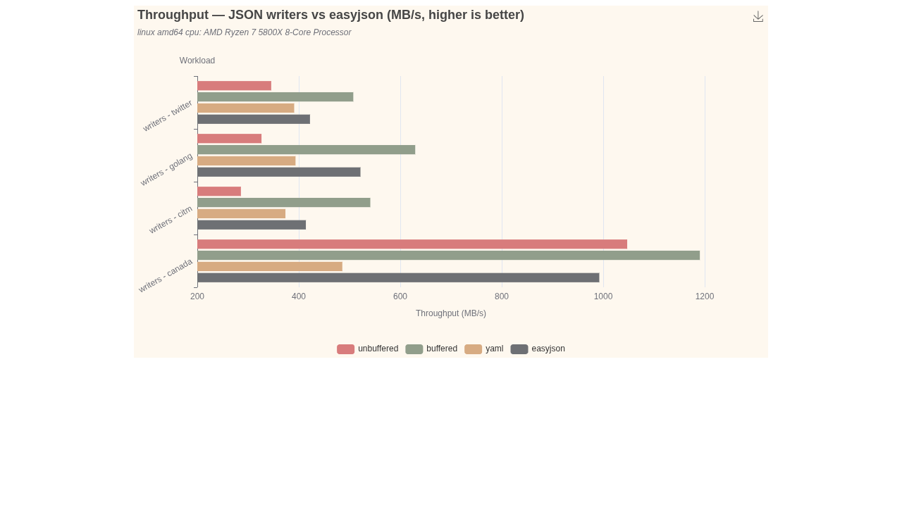

# Throughput chart (benchviz)

Output throughput (MB/s) for the three `default-writer` implementations and easyjson
`jwriter`, grouped by corpus workload. Rendered with
[benchviz](https://github.com/fredbi/benchviz).



## What you are looking at

Each cluster is one workload; within it, the four bars are the writers, side by side.
Longer is faster. The numbers are the **median of 6 runs** (the 2 MiB-buffer variant is
omitted — see the disclaimer below). `our-buffered` leads on every workload.

### The workloads

The corpus is the canonical JSON benchmark set (canada / citm / twitter / golang),
each stressing a different part of the writer:

| workload         | shape                                  | exercises                          |
|------------------|----------------------------------------|------------------------------------|
| `canada_geometry`| number-heavy (geo coordinates)         | the float/number formatting path   |
| `citm_catalog`   | objects and strings (real catalog)     | structural delimiters + keys       |
| `twitter_status` | unicode-rich strings (social payload)  | the string-escaping path           |
| `golang_source`  | deeply structured (Go AST dump)        | nesting depth + mixed token stream |

## What the chart does *not* show

**Allocations.** Throughput is only half the story, and the more important half is not
plottable here. All three of our writers run at **0 allocs/op and 0 B/op** in steady
state, streaming straight to the sink. easyjson allocates **19–72 allocs/op and
≈257 KiB – 1.85 MiB/op** — it builds the whole document in memory before emitting it.
A bar chart of `allocs/op` would be three flat-zero series against one, so it is left
out; the exact figures are in [`../README.md`](../README.md).

**Memory footprint.** This is the design intent behind the writers, and it does not
appear on any axis. Our peak memory is a *fixed* small buffer (a pooled few-KiB slice
for `Buffered`/`YAML`, essentially nothing for `Unbuffered`) — **independent of document
size**. easyjson's peak grows with the document, because the whole output lives in RAM
until `DumpTo`. On `golang_source` that is ~1.85 MiB held at once vs our ~4 KiB. The
writers are *streaming* components; easyjson is an in-memory *builder*. We trade a little
raw speed for a flat memory profile — except that, post-codegen, we no longer trade away
the speed either.

## Micro-benchmark disclaimer

The sink is `io.Discard`, whose `Write` is a no-op: **there is no real I/O here.** This
measures the writer's CPU loop in isolation — token dispatch, escaping, number
formatting, buffer management — not syscalls, not disk, not network. Two consequences:

- Buffering looks "free": flushing to `io.Discard` costs nothing, so `Buffered` and the
  large-buffer variant converge. Against a real syscall-backed sink (file, socket, gzip)
  buffer size matters, and that is where the memory-for-throughput trade actually pays.
- `Unbuffered`'s relative cost is understated/overstated depending on the real sink. Here
  it pays one `Write` call per flush against a no-op; against a real fd you would wrap it
  in a `bufio.Writer` or just use `Buffered`.

Read these bars as *relative writer efficiency*, not as end-to-end serialization speed.

> The `our-yaml` writer is **buffered unconditionally** (it embeds `*Buffered`); there is
> no unbuffered YAML variant. It emits YAML, not JSON, so its throughput is shown for its
> own sake and is not directly comparable to the JSON writers.

## Files

| file            | role                                                              |
|-----------------|-------------------------------------------------------------------|
| `benchviz.yaml` | chart config: 1 metric (MB/s) × 4 workloads (contexts) × 4 impls (versions) |
| `benchmark.txt` | input data: **median of 6 runs**, one line per benchmark, 2MB variant excluded |
| `throughput.png`| rendered output (theme: `vintage`)                                |

## Regenerate

```sh
# 1. raw data: 6 runs (drop the 2MB variant from implementations() for this)
go test -run '^$' -bench BenchmarkWriters -benchmem -count=6 ./.. > raw.txt

# 2. collapse to per-benchmark medians (benchviz plots each entry as its own bar,
#    so feed exactly one line per benchmark)

# 3. render
benchviz -c benchviz.yaml -png -o throughput.png benchmark.txt
```

`benchviz -c benchviz.yaml -r benchmark.txt` prints an ingestion report (no render) to
check every series is matched by the config.

## Notes

- The x-axis auto-scales to a non-zero baseline (~200 MB/s), which visually amplifies the
  gaps; read absolute values from the axis or the benchstat table, not bar length.
- PNG rendering needs a local Chrome/chromedp (see the benchviz README). Themes whose JS
  asset is not bundled (e.g. `westeros`) render blank offline; `vintage` is bundled.
